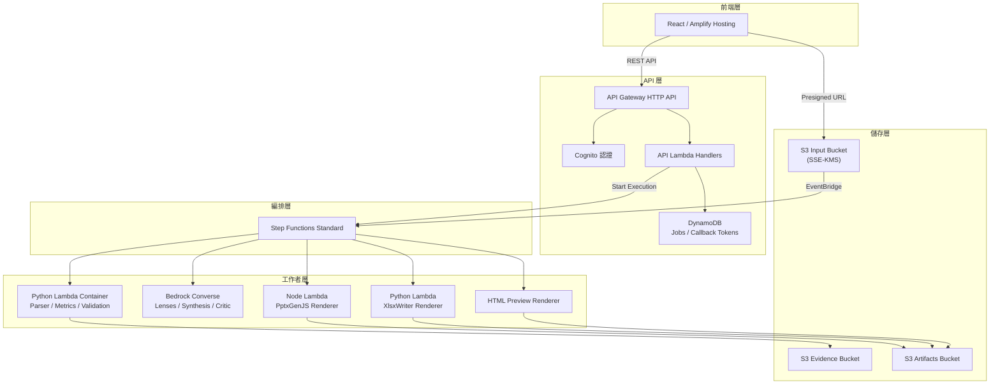
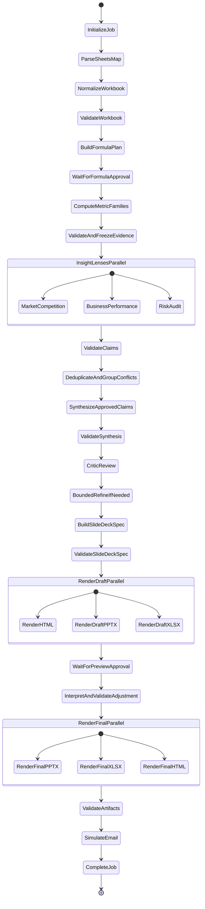
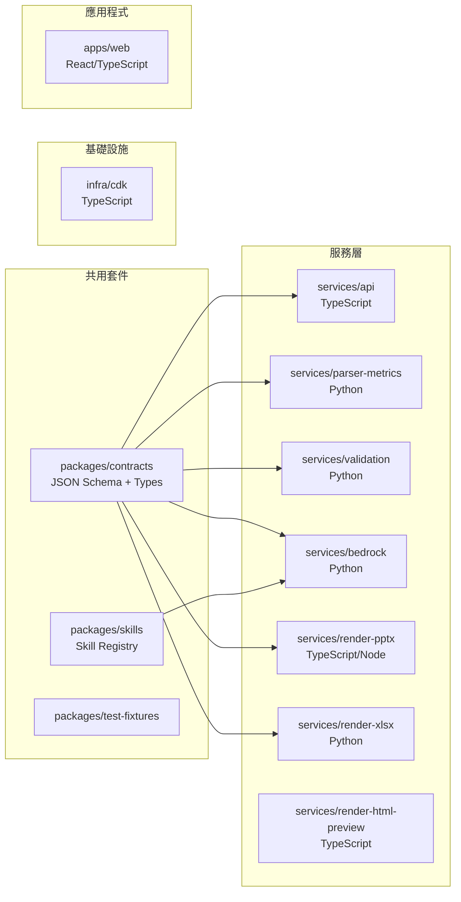

# 技術設計文件：信用卡統計報表轉可編輯 PowerPoint 簡報

## 概覽（Overview）

本設計文件描述「智匯數據簡報神器」的完整技術架構與元件設計。系統將多工作表 Excel 信用卡統計資料，透過確定性計算與 AI 洞察分析，轉換為可追溯、可編輯的原生 PowerPoint 簡報與伴隨 Excel 稽核工作簿。

### 核心設計哲學

- **AI 負責規劃、解讀與敘事**：Bedrock Converse 僅讀取已驗證的 EvidencePacket，不得自行計算
- **確定性程式負責解析、計算、驗證與輸出**：所有數字由 Python 程式計算，可重現且可追溯
- **每一個數字都必須可追溯**：從 PPTX 圖表到原始 Excel 儲存格的完整鏈路
- **每一張圖表都必須可編輯**：PptxGenJS 原生圖表物件，非圖片嵌入

### 系統邊界

- **輸入**：多工作表 Excel 檔案（.xlsx）+ 使用者分析需求文字
- **輸出**：原生可編輯 PPTX、伴隨 XLSX 稽核工作簿、HTML 預覽（含 Source Hover）
- **使用者互動點**：公式計畫確認、預覽審核、自然語言調整、最終核准


## 架構（Architecture）

### 高階架構圖



### Step Functions 工作流 DAG



### 資料流模式

系統採用 **Evidence-First** 資料流模式：

1. **上行資料流（上傳→計算）**：Excel → Parser → Normalizer → Metric Engine → EvidencePacket（凍結）
2. **洞察資料流（只讀）**：EvidencePacket → 3 Insight Lenses → Claims → Validator → ClaimRegistry
3. **合成資料流（只讀）**：ClaimRegistry → Synthesizer → Critic → SlideDeckSpec
4. **渲染資料流（唯一寫入者）**：SlideDeckSpec → Renderer → PPTX / XLSX / HTML

關鍵約束：
- Step Functions State payload ≤ 256 KiB，大型 JSON 一律存入 S3 並傳遞 URI + Hash
- 所有 Parallel branch 必須自行 Catch 並回傳 typed failure
- Callback pattern 用於公式計畫確認與預覽核准兩個人工閘門

### CDK Stack 分層

| Stack | 職責 | 主要資源 |
|-------|------|----------|
| DataStack | 資料持久化與加密 | S3 Buckets (Input/Evidence/Artifacts)、KMS Key、DynamoDB (Jobs/CallbackTokens)、Lifecycle Rules |
| ApiStack | 外部通訊介面 | HTTP API、API Lambda、CORS、Cognito Authorizer |
| WorkflowStack | 業務流程編排 | Step Functions Standard、Worker Lambdas、EventBridge Rule、IAM Roles |
| FrontendStack | 使用者介面部署 | Amplify Hosting、環境變數注入 |
| ObservabilityStack | 監控與告警 | CloudWatch Log Groups、Dashboard、Alarms |

## 元件與介面（Components and Interfaces）

### 元件總覽



### 1. services/parser-metrics（Python Lambda Container）

**職責**：Excel 工作簿解析、資料正規化、公式計畫建立、確定性指標計算

**子模組**：

| 模組 | 功能 |
|------|------|
| `sheet_reader` | 讀取 .xlsx、辨識工作表結構、合併儲存格、表頭區域 |
| `normalizer` | 數字/百分比/日期/月份/單位標準化、期間格式轉換 |
| `source_mapper` | 為每個正規化值建立 SourceRef（工作表名、儲存格地址、原始值） |
| `formula_plan_builder` | 根據需求與可用欄位自動產生公式計畫、標記 unsupported |
| `metric_engine` | 依照核准公式計算市占率、排名、MoM、有效卡率、單卡簽帳等 |
| `evidence_builder` | 組裝 EvidencePacket、計算 canonical SHA-256、凍結版本 |

**關鍵介面**：

```python
# 輸入：S3 URI of uploaded Excel
# 輸出：S3 URI of WorkbookProfile JSON
def parse_sheets(s3_uri: str, job_id: str) -> ParseResult

# 輸入：WorkbookProfile + 使用者需求
# 輸出：FormulaPlan JSON
def build_formula_plan(profile_uri: str, user_request: str) -> FormulaPlanResult

# 輸入：FormulaPlan (approved) + NormalizedWorkbook
# 輸出：EvidencePacket (frozen, with SHA-256)
def compute_and_freeze(plan_uri: str, workbook_uri: str) -> EvidencePacketResult
```

### 2. services/validation（Python Lambda Container）

**職責**：各階段資料完整性驗證、Claim 數值比對、去重與矛盾分組

**子模組**：

| 模組 | 功能 |
|------|------|
| `workbook_validator` | 檢查必要工作表、欄位、格式是否完整 |
| `source_validator` | 驗證 SourceRef 存在性與一致性 |
| `numeric_claim_validator` | 擷取 Claim 中的數字並與 MetricRecord 比對 |
| `period_entity_validator` | 驗證期間、銀行名稱、單位一致性 |
| `unsupported_validator` | 確認 unsupported 指標不出現在 Claim 敘述中 |
| `chart_ranking_validator` | 驗證圖表排序、軸名稱、單位與期間 |
| `claim_deduplicator` | 相同 claim key 合併，重複不提升可信度 |
| `conflict_grouper` | 方向/數字/排名矛盾歸入 ConflictGroup |
| `synthesis_validator` | 驗證統整敘事僅使用 accepted Claim IDs |
| `slide_spec_validator` | 驗證 SlideDeckSpec 與 EvidencePacket 一致性 |
| `artifact_validator` | 驗證最終 PPTX/XLSX 檔案品質 |

**關鍵介面**：

```python
# 通用驗證結果
@dataclass
class ValidationResult:
    passed: bool
    findings: list[Finding]  # typed findings with severity
    blocking_count: int

# 各 Validator 共用簽名
def validate_workbook(profile_uri: str) -> ValidationResult
def validate_claims(claims_uri: str, evidence_uri: str) -> ValidationResult
def validate_slide_spec(spec_uri: str, evidence_uri: str) -> ValidationResult
def validate_artifacts(artifact_uris: dict[str, str]) -> ValidationResult
```

### 3. services/bedrock（Python）

**職責**：Bedrock Converse API 封裝、Skill Registry 載入、Insight Lens 執行、Synthesizer/Critic

**子模組**：

| 模組 | 功能 |
|------|------|
| `converse_client` | 統一 Bedrock Converse 呼叫，Structured Outputs、stop reason 檢查 |
| `skill_loader` | 載入 system.md、output.schema.json、rubric.yaml |
| `market_lens` | 市場競爭角色分析（只讀 EvidencePacket） |
| `performance_lens` | 經營績效角色分析（只讀 EvidencePacket） |
| `risk_lens` | 風險稽核角色分析（只讀 EvidencePacket） |
| `synthesizer` | 統整已驗證 Claims 為連貫敘事 |
| `critic` | 檢查過度推論、Caveat 遺漏、覆蓋率 |
| `adjustment_interpreter` | 解析自然語言調整指令 |

**Bedrock Converse 呼叫規範**：

```python
@dataclass
class ConverseRequest:
    skill_name: str
    skill_version: str
    evidence_packet_uri: str
    output_schema: dict  # JSON Schema with additionalProperties: false
    max_tokens: int = 4096

@dataclass
class ConverseResponse:
    raw_response: dict       # 原始回應保存
    parsed_output: dict      # Schema-validated JSON
    stop_reason: str         # 必須為 "end_turn" 或 "tool_use"
    prompt_hash: str         # 用於稽核
    model_id: str
    repair_attempted: bool   # 是否執行過一次 repair
```

### 4. services/render-pptx（TypeScript/Node Lambda）

**職責**：使用 PptxGenJS 將 SlideDeckSpec 轉換為原生可編輯 PPTX

**關鍵設計決策**：
- 使用 `pptxgenjs` 原生 API 建立 chart objects（非圖片）
- 使用 `defineSlideMaster` 重建台新官方品牌版型
- 圖表資料內嵌於 PowerPoint XML 結構中

**子模組**：

| 模組 | 功能 |
|------|------|
| `template_registry` | 封面、目錄、章節、圖表、表格、結尾頁的 Slide Master 定義 |
| `chart_builder` | 將 ChartDataSpec 轉為 PptxGenJS chart config |
| `table_builder` | 將表格資料轉為原生 PowerPoint table object |
| `text_builder` | 將敘述文字套用品牌字體與排版 |
| `brand_tokens` | 16:9 比例、紅白漸層、Logo、字體、頁首頁尾常數 |

**介面**：

```typescript
interface RenderPptxInput {
  slideDeckSpecUri: string;  // S3 URI
  evidencePacketUri: string; // S3 URI for chart data
  templateTokens: BrandTokens;
  jobId: string;
}

interface RenderPptxOutput {
  artifactUri: string;    // S3 URI of generated PPTX
  artifactHash: string;   // SHA-256
  slideCount: number;
  chartCount: number;
  tableCount: number;
}
```

### 5. services/render-xlsx（Python Lambda）

**職責**：使用 XlsxWriter 產生伴隨 XLSX 稽核工作簿

**必要工作表**：

| 工作表 | 內容 |
|--------|------|
| SourceManifest | 所有原始工作表與儲存格的清冊 |
| NormalizedData | 正規化後的資料表 |
| Metrics | 所有計算指標、公式定義與來源 |
| ChartData | 圖表使用的資料系列 |
| Claims | 所有已接受的 Claim 清冊 |
| Citations | Claim → MetricRecord → SourceRef 完整追蹤鏈 |
| ValidationReport | 驗證結果摘要 |

### 6. services/render-html-preview（TypeScript）

**職責**：產生 16:9 HTML 預覽含 Source Hover 功能

**功能**：
- 每張投影片的縮圖與全頁預覽
- Source Hover：滑鼠移至數字顯示 Metric 名稱、公式、工作表、儲存格、Caveat
- 台新品牌樣式（紅白漸層、Logo）
- Source Hover Manifest JSON 供前端使用

### 7. services/api（TypeScript Lambda）

**職責**：HTTP API 請求處理、Job 生命周期管理、Presigned URL 產生

**API 端點**：

| 方法 | 路徑 | 功能 |
|------|------|------|
| POST | /jobs | 建立新 Job |
| POST | /jobs/{jobId}/start | 啟動工作流 |
| GET | /jobs/{jobId} | 查詢 Job 狀態 |
| GET | /jobs/{jobId}/formula-plan | 取得公式計畫 |
| POST | /jobs/{jobId}/formula-approval | 核准/修改公式計畫 |
| GET | /jobs/{jobId}/preview | 取得 HTML 預覽 |
| POST | /jobs/{jobId}/adjustments | 提交自然語言調整 |
| POST | /jobs/{jobId}/draft-approval | 核准最終版本 |
| GET | /jobs/{jobId}/artifacts/{type} | 取得下載 URL |
| POST | /jobs/{jobId}/simulate-email | 模擬寄送 |

### 8. packages/contracts

**職責**：跨語言資料契約的單一真實來源

- JSON Schema 為 canonical 定義
- TypeScript：Zod schema + Ajv 驗證
- Python：Pydantic model + jsonschema 驗證
- 所有 schema 設定 `additionalProperties: false` 與明確 enum

### 9. packages/skills（Skill Registry）

**結構**：

```
packages/skills/
  market-competition/v1/
    system.md          # 系統提示詞
    output.schema.json # 輸出 JSON Schema
    rubric.yaml        # 品質評分準則
  business-performance/v1/
  audit-risk/v1/
  synthesis/v1/
  critic/v1/
  adjustment/v1/
```

每次執行記錄：Skill version、model ID、prompt hash、EvidencePacket hash、輸出 hash。

## 資料模型（Data Models）

### 核心資料結構

#### Job

```json
{
  "jobId": "job-uuid",
  "tenantId": "tenant-001",
  "status": "processing | waiting_formula_approval | waiting_preview_approval | completed | failed",
  "currentStage": "ParseSheetsMap",
  "inputS3Uri": "s3://input/tenant/job/source.xlsx",
  "userRequest": "分析台新信用卡 114 年 1-12 月市占率與排名趨勢",
  "createdAt": "2025-01-01T00:00:00Z",
  "updatedAt": "2025-01-01T00:05:00Z",
  "artifactManifest": {
    "pptxUri": "s3://...",
    "xlsxUri": "s3://...",
    "htmlPreviewUri": "s3://..."
  },
  "auditLog": []
}
```

#### SourceRef

```json
{
  "sourceId": "src-001",
  "sheetName": "簽帳金額",
  "cellAddress": "C5",
  "rawValue": "10.61%",
  "normalizedValue": 0.1061,
  "dataType": "percentage",
  "period": "11412",
  "entity": "台新銀行"
}
```

#### MetricRecord

```json
{
  "metricId": "metric-share-001",
  "metricName": "transaction_share",
  "formulaId": "formula-market-share",
  "formulaDefinition": "bank_amount / total_amount * 100",
  "inputSourceIds": ["src-001", "src-002"],
  "computedValue": 10.61,
  "unit": "percent",
  "period": "11412",
  "entity": "台新銀行",
  "rank": 5,
  "rankTotal": 15,
  "computationSteps": ["src-001.value / src-002.value * 100 = 10.61"]
}
```

#### EvidencePacket

```json
{
  "packetId": "evp-job-001-v1",
  "jobId": "job-001",
  "workbook": {
    "s3Uri": "s3://input/job-001/source.xlsx",
    "sha256": "abc123..."
  },
  "formulaPlanId": "formula-plan-v1",
  "sourceRefs": ["SourceRef[]"],
  "metrics": ["MetricRecord[]"],
  "chartDataSpecs": ["ChartDataSpec[]"],
  "validationFindings": ["Finding[]"],
  "unsupportedRequests": [
    {
      "metricName": "yoy_growth",
      "reason": "缺少 113 年資料",
      "requiredPeriods": ["11301-11312"],
      "availablePeriods": ["11401-11412"]
    }
  ],
  "frozen": true,
  "frozenAt": "2025-01-01T00:03:00Z",
  "canonicalSha256": "def456..."
}
```

#### FormulaPlan

```json
{
  "planId": "formula-plan-v1",
  "jobId": "job-001",
  "formulas": [
    {
      "formulaId": "formula-market-share",
      "name": "簽帳金額市占率",
      "definition": "bank_amount / total_amount * 100",
      "inputs": [
        {"field": "簽帳金額", "sheet": "簽帳金額", "entity": "各銀行"}
      ],
      "unit": "percent",
      "displayFormat": "##.##%",
      "supported": true
    }
  ],
  "unsupported": [
    {
      "name": "年增率",
      "reason": "缺少 113 年同期資料",
      "wouldRequire": ["11301-11312 簽帳金額"]
    }
  ],
  "assumptions": ["期間格式為民國年月 (11401=114年1月)", "金額單位為新台幣百萬元"],
  "version": 1,
  "status": "pending_approval | approved | rejected"
}
```

#### RoleInsight（洞察透鏡輸出）

```json
{
  "role": "market_competition | business_performance | risk_audit",
  "packetId": "evp-job-001-v1",
  "claims": [
    {
      "claimId": "claim-mc-001",
      "claimKey": "taishin|transaction_share|11412",
      "statement": "台新 114 年 12 月簽帳金額市占率為 10.61%，排名第 5。",
      "evidenceIds": ["metric-share-001", "metric-rank-001"],
      "businessImplication": "消費貢獻略低於流通卡市占，可能反映客群消費力差異。",
      "caveats": ["僅含簽帳金額，不含預借現金"],
      "counterEvidence": [],
      "direction": "neutral",
      "magnitude": "moderate"
    }
  ],
  "metadata": {
    "modelId": "anthropic.claude-3-sonnet-20240229-v1:0",
    "promptHash": "sha256:...",
    "skillVersion": "v1",
    "generatedAt": "2025-01-01T00:04:00Z"
  }
}
```

#### Claim（宣稱）

```json
{
  "claimId": "claim-mc-001",
  "claimKey": "taishin|transaction_share|11412",
  "sourceRole": "market_competition",
  "statement": "台新 114 年 12 月簽帳金額市占率為 10.61%，排名第 5。",
  "extractedNumbers": [
    {"value": 10.61, "unit": "percent", "metricId": "metric-share-001"},
    {"value": 5, "unit": "rank", "metricId": "metric-rank-001"}
  ],
  "evidenceIds": ["metric-share-001", "metric-rank-001"],
  "status": "accepted | rejected | conflict",
  "rejectionReason": null,
  "conflictGroupId": null
}
```

#### ConflictGroup（矛盾組）

```json
{
  "conflictGroupId": "conflict-001",
  "conflictType": "direction | numeric | ranking",
  "claims": ["claim-mc-001", "claim-bp-003"],
  "description": "市場競爭 Lens 稱排名第 5，經營績效 Lens 稱排名第 4",
  "resolution": "blocked",
  "evidenceMetricId": "metric-rank-001",
  "correctValue": 5
}
```

#### SlideDeckSpec（簡報規格）

```json
{
  "specId": "spec-001",
  "jobId": "job-001",
  "packetId": "evp-job-001-v1",
  "slides": [
    {
      "slideIndex": 0,
      "layout": "cover",
      "masterId": "cover-master",
      "content": {
        "title": "台新信用卡 114 年度市場分析",
        "subtitle": "月度簽帳金額與市占趨勢報告"
      }
    },
    {
      "slideIndex": 3,
      "layout": "chart",
      "masterId": "chart-master",
      "content": {
        "title": "簽帳金額市占率趨勢",
        "claimIds": ["claim-mc-001", "claim-mc-002"],
        "chart": {
          "type": "line",
          "chartDataSpecId": "chart-share-trend",
          "xAxis": {"label": "月份", "format": "11401-11412"},
          "yAxis": {"label": "市占率 (%)", "min": 0, "max": 20},
          "series": ["台新銀行", "中國信託", "國泰世華"]
        },
        "sourceHoverTargets": [
          {"text": "10.61%", "metricId": "metric-share-001"}
        ]
      }
    }
  ],
  "version": 1,
  "status": "draft | validated | approved"
}
```

#### WorkbookProfile

```json
{
  "profileId": "profile-001",
  "jobId": "job-001",
  "sourceFileUri": "s3://...",
  "sourceFileHash": "sha256:...",
  "sheets": [
    {
      "sheetName": "簽帳金額",
      "headerRow": 1,
      "dataStartRow": 2,
      "dataEndRow": 17,
      "columns": ["銀行", "11401", "11402", "..."],
      "mergedCells": [],
      "dataQuality": {"nullCount": 0, "formatIssues": []}
    }
  ],
  "detectedPeriods": ["11401", "11402", "...", "11412"],
  "detectedEntities": ["台新銀行", "中國信託", "..."],
  "detectedUnits": {"amount": "百萬元", "rate": "percent"}
}
```

### DynamoDB 表設計

| 表名 | PK | SK | 用途 |
|------|----|----|------|
| Jobs | `tenantId` | `jobId` | Job 狀態與 metadata |
| CallbackTokens | `jobId` | `waitType#timestamp` | Step Functions callback token 暫存 |

### S3 Prefix 結構

```
input/{tenantId}/{jobId}/source.xlsx
evidence/{tenantId}/{jobId}/v{n}/
  workbook-profile.json
  formula-plan.json
  normalized-workbook.json
  evidence-packet.json
preview/{tenantId}/{jobId}/v{n}/
  html-preview/
  source-hover-manifest.json
artifacts/{tenantId}/{jobId}/v{n}/
  output.pptx
  companion.xlsx
  validation-report.json
audit/{tenantId}/{jobId}/
  audit-events.jsonl
```

## 正確性屬性（Correctness Properties）

*正確性屬性是系統在所有有效執行中應維持的特性或行為——本質上是關於系統應該做什麼的形式化陳述。屬性作為人類可讀規格與機器可驗證正確性保證之間的橋樑。*

### Property 1: 正規化保留來源追蹤性（Normalization Source Traceability）

*For any* 正規化後的數值，該數值必須擁有一個對應的 SourceRef，記錄原始工作表名稱、儲存格地址與原始值，且 SourceRef 的原始值經過相同正規化邏輯後應等於正規化值。

**Validates: Requirements 2.1, 2.2**

### Property 2: 期間格式正規化一致性（Period Format Normalization）

*For any* 原始期間字串，經正規化後應產生符合 `YYMM` 格式（如 11401）的標準期間值，且相同的原始輸入永遠產生相同的正規化結果。

**Validates: Requirements 2.3**

### Property 3: 公式計畫輸入可用性（Formula Plan Input Availability）

*For any* 公式計畫中的公式，其所有 `inputs` 引用的欄位必須存在於 WorkbookProfile 的可用欄位中；若任何必要輸入欄位缺失，則該公式必須被標記為 `unsupported` 並附帶原因。

**Validates: Requirements 3.1, 3.2**

### Property 4: 確定性計算正確性（Deterministic Computation Correctness）

*For any* 已核准公式與對應輸入值集合，Metric_Engine 計算的結果應等於該公式數學定義的精確結果（允許浮點誤差 ≤ 1e-10），且相同輸入永遠產生相同輸出。

**Validates: Requirements 4.1**

### Property 5: 指標來源完整性（Metric Provenance Completeness）

*For any* 計算產生的 MetricRecord，其 `inputSourceIds` 必須非空、所有引用的 SourceRef ID 必須存在於 EvidencePacket 中、`formulaDefinition` 必須非空、且 `computationSteps` 必須包含至少一個步驟。

**Validates: Requirements 4.2**

### Property 6: EvidencePacket 序列化決定性（EvidencePacket Serialization Determinism）

*For any* EvidencePacket，將其序列化為 canonical JSON 後計算 SHA-256，重複此過程任意次數，所得 hash 值應完全相同。

**Validates: Requirements 4.3**

### Property 7: EvidencePacket 凍結不可變性（EvidencePacket Immutability）

*For any* 已凍結的 EvidencePacket，任何對其 metrics、sourceRefs、chartDataSpecs 或 validationFindings 的修改操作都應拋出錯誤，且凍結前後的 canonicalSha256 不變。

**Validates: Requirements 4.4, 5.2**

### Property 8: 計算異常標記（Computation Error Marking）

*For any* 公式計算中遭遇除以零、資料缺失或單位不一致的情況，Metric_Engine 應將該 MetricRecord 標記為 `invalid`，附帶錯誤原因，且該指標不得出現在後續的有效 Claim 中。

**Validates: Requirements 4.5**

### Property 9: Claim 證據引用有效性（Claim Evidence Reference Validity）

*For any* Insight_Lens 產生的 Claim，其所有 `evidenceIds` 必須存在於當前凍結的 EvidencePacket 中，且所引用的 MetricRecord 的 `computedValue` 必須與 Claim 中擷取的數字一致。

**Validates: Requirements 5.6, 5.7, 6.2**

### Property 10: Claim 數值一致性（Claim Numeric Consistency）

*For any* Claim 中包含的數字（百分比、金額、排名），該數字必須與其引用的 MetricRecord 的 `computedValue` 或 `rank` 精確匹配。若 Claim 陳述 A 的值大於 B，則 EvidencePacket 中 A 的實際數值必須嚴格大於 B。

**Validates: Requirements 6.1, 6.6, 14.3, 14.4**

### Property 11: 不支援指標阻擋（Unsupported Metric Blocking）

*For any* 被標記為 `unsupported` 的指標（如缺少 113 年資料的 YoY），任何在 Claim 敘述中引用該指標名稱或使用其計算結果的 Claim，都必須被 Validator 拒絕。

**Validates: Requirements 6.3, 14.1**

### Property 12: Claim 去重冪等性（Claim Deduplication Idempotence）

*For any* Claim 集合，對其執行去重操作後，相同 `claimKey` 的 Claim 應合併為恰好一個；對去重結果再執行一次去重，結果應完全相同（冪等性）。

**Validates: Requirements 6.4**

### Property 13: 矛盾偵測與阻擋（Conflict Detection and Blocking）

*For any* 兩個 Claim，若其引用相同實體與期間但數值方向相反（一個稱上升另一個稱下降）、排名不同、或數值矛盾，則 Validator 必須將兩者歸入同一個 ConflictGroup，且兩者都不得進入最終敘事。

**Validates: Requirements 6.5**

### Property 14: 統整敘事僅使用已接受 Claim（Synthesis Accepted-Only Constraint）

*For any* Synthesizer 產出的統整敘事，其中引用的所有 Claim IDs 必須存在於 ClaimRegistry 且狀態為 `accepted`；敘事中出現的所有數字必須能在某個 accepted Claim 的 `extractedNumbers` 中找到對應值；不得包含任何 `rejected` 或 `conflict` 狀態的 Claim ID。

**Validates: Requirements 7.1, 7.2, 7.3**

### Property 15: SlideDeckSpec 追蹤完整性（SlideDeckSpec Traceability）

*For any* SlideDeckSpec 中的投影片，每個包含數字或結論的內容元素必須引用至少一個有效的 accepted Claim ID，且每個圖表必須引用有效的 `chartDataSpecId`。

**Validates: Requirements 8.1, 8.2**

### Property 16: 圖表規格與證據一致性（Chart Spec-Evidence Consistency）

*For any* SlideDeckSpec 中的圖表規格，其座標軸名稱、單位、期間範圍與排名順序必須與 EvidencePacket 中對應的 ChartDataSpec 和 MetricRecords 精確一致。

**Validates: Requirements 8.4, 14.2**

### Property 17: Source Hover 完整性（Source Hover Completeness）

*For any* Source Hover 目標（HTML 預覽中可懸停的數字），其 manifest 必須包含：Metric 名稱、公式定義、原始工作表名稱、儲存格地址、以及相關 Caveat（若有）。

**Validates: Requirements 9.2**

### Property 18: 調整數字保護（Adjustment Number Protection）

*For any* 使用者提交的自然語言調整，若該調整嘗試修改數字、排名或移除必要 Caveat，系統必須拒絕；調整完成後，SlideDeckSpec 中所有 Source Hover 目標與 Evidence ID 引用必須與調整前完全一致。

**Validates: Requirements 10.3, 10.5**

### Property 19: PPTX 原生圖表物件（PPTX Native Chart Objects）

*For any* 產生的 PPTX 檔案中的圖表，其在 OOXML 結構中必須存在為 `<c:chartSpace>` 元素（chart part），不得以 `<p:pic>` 圖片元素形式嵌入。

**Validates: Requirements 11.3**

### Property 20: PPTX 原生表格物件（PPTX Native Table Objects）

*For any* 產生的 PPTX 檔案中的表格，其必須以 `<a:tbl>` 原生表格元素存在，不得以多個 `<p:sp>` 文字框或幾何圖形堆疊模擬。

**Validates: Requirements 11.4**

### Property 21: 跨 Artifact 數值一致性（Cross-Artifact Numeric Consistency）

*For any* 同時出現在 PPTX 圖表與 XLSX Metrics 工作表中的指標值，兩者必須精確相等（允許浮點表示差異 ≤ 1e-10）。

**Validates: Requirements 12.4**

### Property 22: State Payload 大小約束（State Payload Size Constraint）

*For any* Step Functions 狀態轉換產生的 state payload JSON，其 UTF-8 編碼後的位元組長度必須 ≤ 262,144 bytes（256 KiB）。

**Validates: Requirements 13.2**

## 錯誤處理（Error Handling）

### 錯誤分類

系統定義三級錯誤分類：

| 等級 | 名稱 | 行為 | 範例 |
|------|------|------|------|
| BLOCKING | 阻擋 | 停止當前流程，需人工介入 | 必要工作表缺失、所有 Lens 失敗 |
| WARNING | 警告 | 降級繼續，通知使用者 | 單一非關鍵 Lens 失敗、資料品質低 |
| INFO | 資訊 | 記錄但不影響流程 | unsupported 指標已標記 |

### Typed Failure 結構

```json
{
  "errorType": "WORKBOOK_VALIDATION_FAILED | CLAIM_NUMERIC_MISMATCH | LENS_EXECUTION_FAILED | ...",
  "severity": "blocking | warning | info",
  "stage": "ValidateWorkbook | ValidateClaims | ...",
  "message": "人類可讀錯誤訊息",
  "details": {
    "expectedValue": 10.61,
    "actualValue": 10.7,
    "metricId": "metric-share-001",
    "claimId": "claim-mc-001"
  },
  "recoverable": false,
  "suggestedAction": "請檢查原始 Excel 中 C5 儲存格的值"
}
```

### 各階段錯誤處理策略

#### 解析階段（Parse）

| 錯誤情境 | 處理方式 |
|----------|----------|
| 檔案無法讀取 | BLOCKING → 回傳錯誤訊息，Job 標記 failed |
| 格式不支援（非 .xlsx） | BLOCKING → 回傳支援格式清單 |
| 合併儲存格結構異常 | WARNING → 嘗試最佳推斷，記錄品質問題 |
| 工作表名稱無法辨識 | WARNING → 列出未辨識工作表供使用者確認 |

#### 計算階段（Compute）

| 錯誤情境 | 處理方式 |
|----------|----------|
| 除以零 | 標記 MetricRecord 為 invalid，不中斷整體計算 |
| 輸入資料缺失 | 標記該指標為 invalid，記錄缺少的 SourceRef |
| 單位不一致 | BLOCKING → 阻擋 EvidencePacket 凍結 |
| SHA-256 計算失敗 | BLOCKING → 重試一次，仍失敗則 Job failed |

#### Bedrock 階段（AI Lenses）

| 錯誤情境 | 處理方式 |
|----------|----------|
| Structured Output 不符 schema | 嘗試一次 repair（重新提示），仍失敗則降級 |
| 單一 Lens timeout/throttle | 該 Lens 標記為 degraded，其他 Lens 繼續 |
| 所有 Lens 失敗 | BLOCKING → 進入人工審核 |
| stop_reason 非 end_turn | 記錄異常，嘗試一次 repair |
| Model 輸出包含新數字 | Validator 拒絕，要求重新生成（最多一次） |

#### 驗證階段（Validate）

| 錯誤情境 | 處理方式 |
|----------|----------|
| Claim 數字與 Evidence 不符 | BLOCKING → 拒絕該 Claim |
| Evidence ID 不存在 | BLOCKING → 拒絕該 Claim |
| 矛盾偵測 | 歸入 ConflictGroup，阻擋進入 Synthesis |
| SlideDeckSpec 排名不一致 | BLOCKING → 拒絕 Spec，要求重建 |

#### 渲染階段（Render）

| 錯誤情境 | 處理方式 |
|----------|----------|
| PptxGenJS 圖表建立失敗 | BLOCKING → 記錄圖表規格並重試一次 |
| PPTX 含 repair indicator | BLOCKING → Artifact 驗證失敗 |
| XLSX 工作表缺失 | BLOCKING → 重新渲染 |
| 跨 Artifact 數值不一致 | BLOCKING → 阻擋輸出 |

### Step Functions 錯誤處理模式

```json
{
  "Catch": [
    {
      "ErrorEquals": ["LensExecutionFailed"],
      "Next": "HandleDegradedLens",
      "ResultPath": "$.error"
    },
    {
      "ErrorEquals": ["States.ALL"],
      "Next": "HandleUnexpectedError",
      "ResultPath": "$.error"
    }
  ],
  "Retry": [
    {
      "ErrorEquals": ["States.TaskFailed"],
      "IntervalSeconds": 2,
      "MaxAttempts": 2,
      "BackoffRate": 2.0
    }
  ]
}
```

### Bounded Refine 策略

- Critic 發現問題 → 最多觸發一次 Synthesizer 修正
- 修正後仍不通過 → 標記降級結果，不再重試
- 避免無限迴圈、成本失控與延遲爆增

## 測試策略（Testing Strategy）

### 測試金字塔

```
                    ┌─────────────┐
                    │   E2E Test  │  1-2 完整流程
                    ├─────────────┤
                ┌───┤ Integration │  各階段串接、AWS 服務互動
                │   ├─────────────┤
            ┌───┤   │  Property   │  22 個正確性屬性 × 100+ 迭代
            │   │   ├─────────────┤
        ┌───┤   │   │    Unit     │  個別函數、邊界條件、錯誤處理
        │   │   │   └─────────────┘
        └───┴───┴───────────────────
```

### 雙軌測試方法

本系統採用 **Property-Based Testing（PBT）** 與 **Example-Based Unit Testing** 並行：

- **Property Tests**：驗證所有有效輸入下的通用正確性屬性
- **Unit Tests**：驗證特定案例、邊界條件與錯誤情境
- 兩者互補：PBT 覆蓋廣泛輸入空間，Unit Tests 確保關鍵路徑

### Property-Based Testing 配置

**Python（services/parser-metrics、services/validation）**：
- 使用 **Hypothesis** 函式庫
- 每個 Property test 至少 100 次迭代
- 自定義 Strategy 產生器用於 SourceRef、MetricRecord、Claim 等結構

**TypeScript（services/render-pptx、services/api）**：
- 使用 **fast-check** 函式庫
- 每個 Property test 至少 100 次迭代
- 自定義 Arbitrary 產生器用於 SlideDeckSpec、ChartDataSpec 等結構

**測試標記格式**：
每個 property test 必須包含註解引用設計文件中的對應屬性：

```python
# Feature: credit-card-report-to-pptx, Property 1: 正規化保留來源追蹤性
@given(st.from_type(NormalizedValue))
def test_normalization_preserves_source_traceability(value):
    ...
```

```typescript
// Feature: credit-card-report-to-pptx, Property 19: PPTX 原生圖表物件
fc.assert(
  fc.property(fc.record({...}), (chartSpec) => {
    ...
  }),
  { numRuns: 100 }
);
```

### 測試分類與覆蓋

| 層級 | 工具 | 覆蓋範圍 | 執行頻率 |
|------|------|----------|----------|
| Unit (Python) | pytest + Hypothesis | Parser、Normalizer、MetricEngine、Validators | 每次 commit |
| Unit (TypeScript) | vitest + fast-check | Renderer、API handlers、Contract validation | 每次 commit |
| Contract | Ajv + Pydantic | 跨語言 schema 一致性 | 每次 commit |
| Integration | pytest + moto/localstack | S3、DynamoDB、Step Functions 互動 | 每次 PR |
| E2E | pytest | 完整 happy-path 與 4 個 failure-path | 每日 / 部署前 |
| Artifact QA | 手動 + python-pptx 檢查 | PPTX/XLSX 可開啟、可編輯 | 每次輸出格式變更 |

### Regression Test 案例（已知錯誤）

基於附件三錯誤簡報建立的 regression tests：

| 案例 ID | 錯誤描述 | 期望行為 |
|---------|----------|----------|
| REG-001 | 缺少 113 年資料時產生 YoY | Validator 阻擋，標記 unsupported |
| REG-002 | 座標軸尺度/單位/期間錯誤 | Chart Validator 拒絕圖表規格 |
| REG-003 | 排名與原始數值不一致 | Numeric Claim Validator 拒絕 |
| REG-004 | 敘述與數字矛盾（如 10.7% > 11.0%） | Direction Validator 標記矛盾 |
| REG-005 | 圖表以圖片嵌入 | Artifact Validator 判定失敗 |
| REG-006 | 表格以文字框堆疊 | Artifact Validator 判定失敗 |

### Golden Test 資料

使用附件四（預期修正參照資料.xlsx）建立 golden test fixtures：
- 正確的市占率數值
- 正確的排名順序
- 正確的圖表資料系列
- 作為所有計算的 expected output 基準

### Mock 策略

| 元件 | Mock 方式 |
|------|-----------|
| S3 | moto / localstack |
| DynamoDB | moto / localstack |
| Bedrock Converse | 預錄 JSON 回應 + schema 驗證 |
| Step Functions | 本地狀態機模擬器 |
| Excel 檔案 | test-fixtures 中的固定 .xlsx |

### CI/CD 整合

```yaml
# 測試階段
test:
  - unit-python:    pytest services/ --hypothesis-seed=random
  - unit-typescript: vitest --run
  - contract:       跨語言 schema 驗證
  - integration:    pytest tests/integration/ (with moto)
  - e2e:           pytest tests/e2e/ (with deployed stack)
  - artifact-qa:   python-pptx 結構檢查
```

